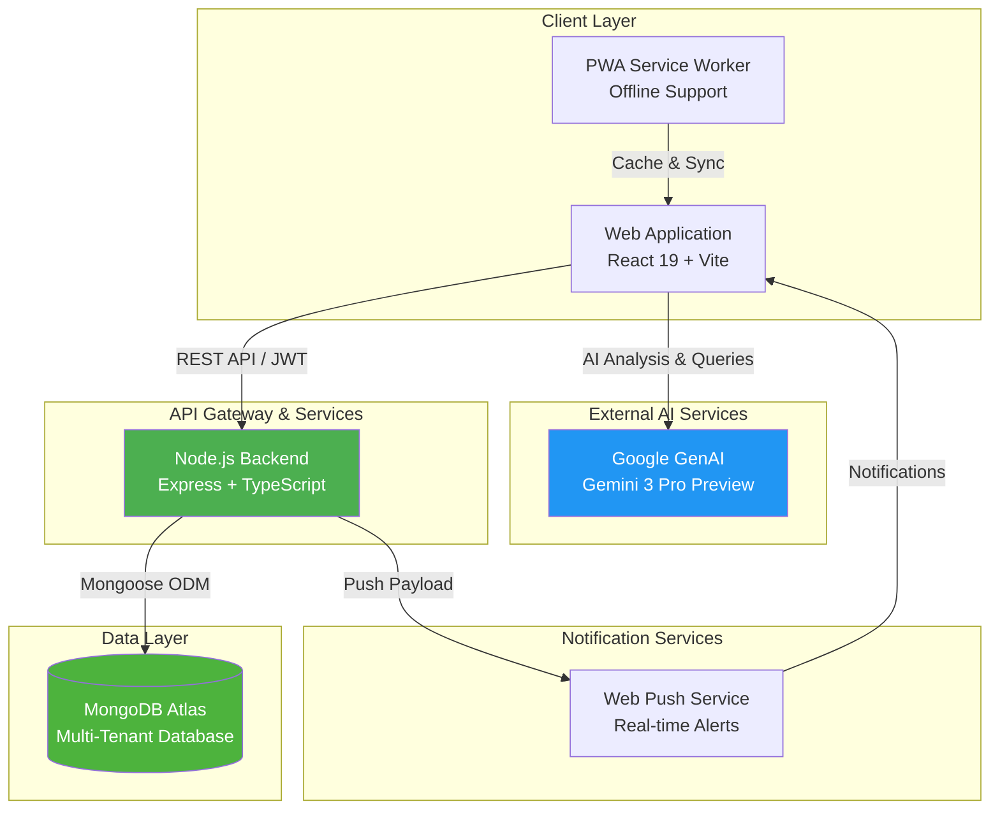
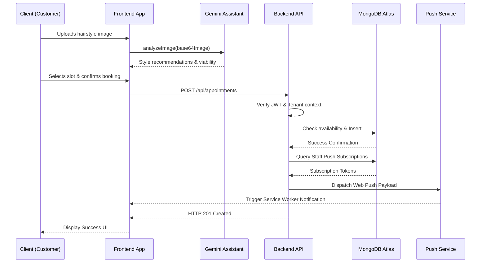
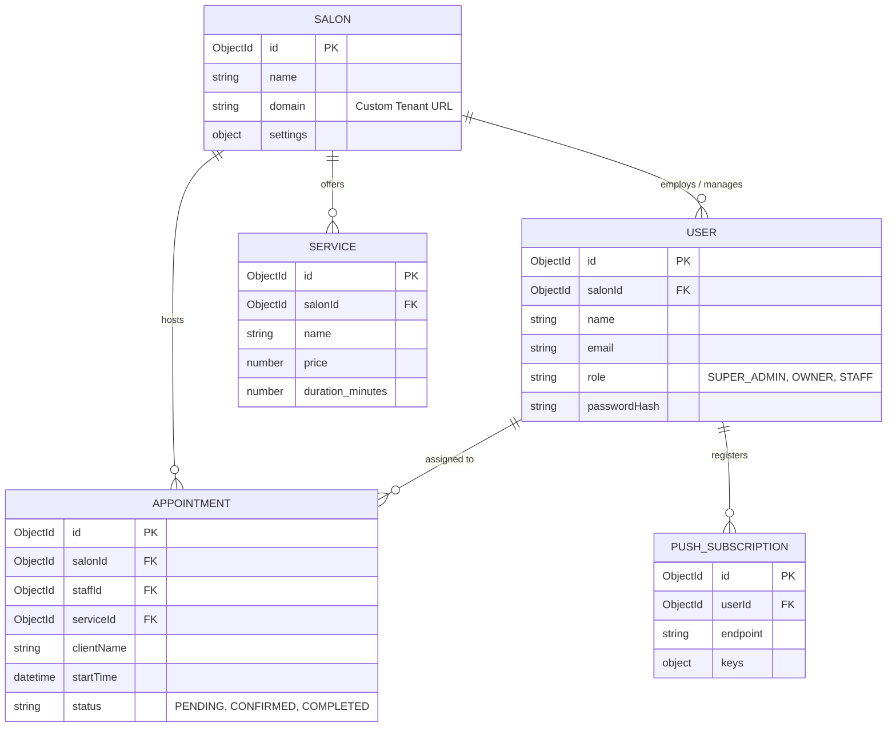
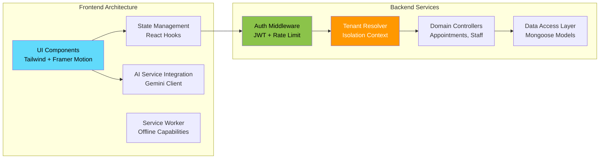
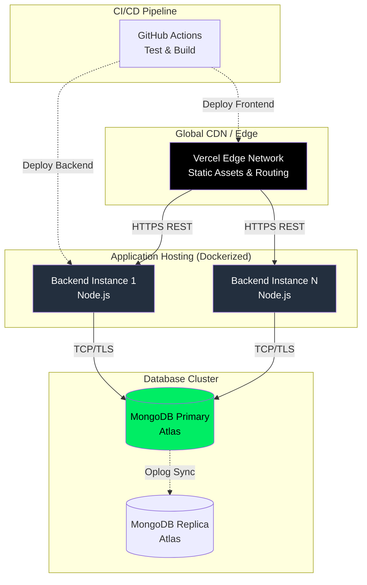

# Reservi - System Architecture

**A high-performance, multi-tenant SaaS architecture designed for scalable salon and barbershop management.**

---

## 🏗️ High-Level System Architecture

Reservi is built on a decoupled, microservices-inspired architecture that separates the presentation layer from the core business logic. It leverages cloud-native principles, real-time communication, and AI capabilities for a seamless user experience.

## 🔄 Core Request Flow

The following sequence illustrates the reservation process and real-time state propagation across the system.

## 💾 Data Model (Multi-Tenant)

The database schema enforces tenant isolation at the document level. Every operational entity references a root `Salon` (Tenant) to guarantee logical separation and secure access control.

## 🧩 Component Breakdown

## 🛠️ Technology Stack & Infrastructure

### Presentation Layer
* **React 19 & TypeScript**: Strong typing and concurrent rendering for a robust user interface.
* **Vite**: Ultra-fast build tooling and hot module replacement (HMR).
* **Tailwind CSS & Framer Motion**: Utility-first styling combined with fluid physics-based animations.
* **Google GenAI Integration**: Direct client-to-cloud AI interactions for image analysis and business strategy querying.

### Application Layer
* **Node.js & Express**: High-throughput, non-blocking asynchronous request handling.
* **JWT & bcryptjs**: Stateless authentication and secure password hashing.
* **Web Push API**: Native browser notifications for real-time staff alerts.
* **Helmet & Express Rate Limit**: Production-grade security middleware.

### Persistence Layer
* **MongoDB Atlas**: Fully managed cloud NoSQL database optimized for document-based tenant structures.
* **Mongoose**: Schema validation and object data modeling mapping.

## 🌐 Deployment Architecture

Reservi's deployment pipeline is optimized for edge-delivery and highly-available containerized microservices.

